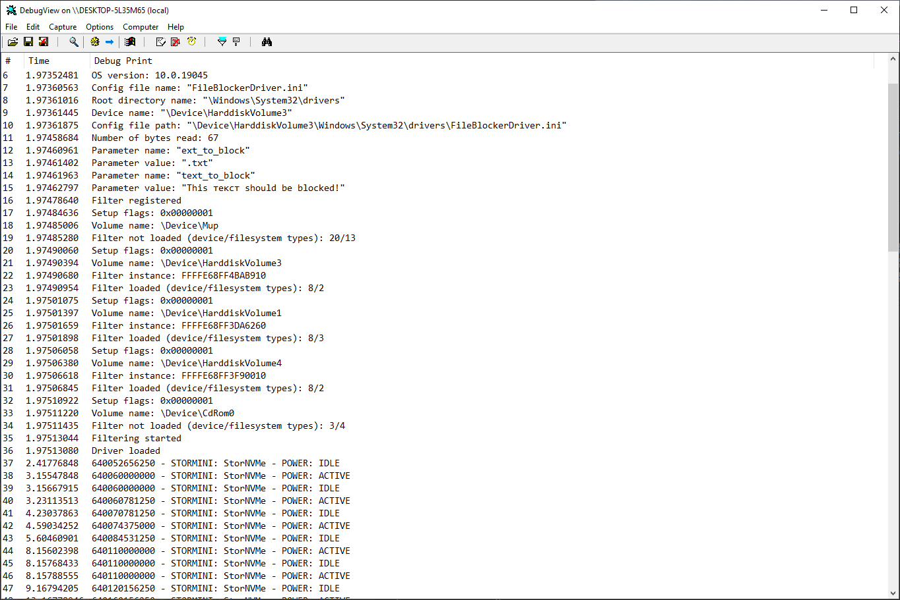
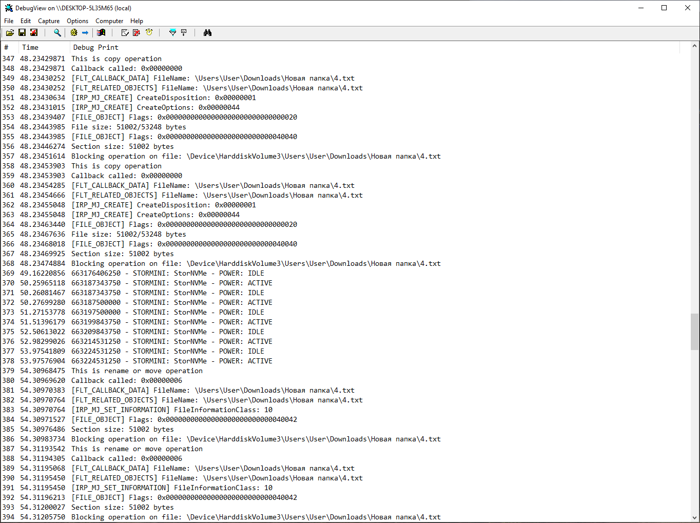
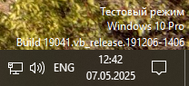
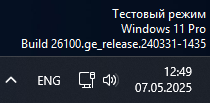

# Тестовые задания

Набор из двух тестовых [заданий](doc/tasks.pdf) (орфография и пунктуация автора сохранены) для разработчика ПО по защите и контролю доступа к чувствительным данным.

**Проект находится в разработке.**

# Сборка

Проект для первого задания написан в Vsual Studio 2022, настроены конфигурации Release и Debug для платформы x64.

Собранный со всеми последними правками (конфигурация Debug для платформы x64) и подписанный моим самоподписанным/самозаверенным [сертификатом](dist/driver/FileBlockerDriver.cer) (подписан и SYS- и CAT-файл) драйвер выложен [здесь](dist/driver).

### Тестовое задание #1

Для решения поставленной задачи был ***разработан драйвер мини-фильтра файловой системы***, который **блокирует опреции перемещения (в том числе в/из корзины), копирования и переименования файлов с заданным расширением (включая точку) и текстом (целиком, не более 256 символов) в начале**. Мини-фильтр драйвер предназначен для любых файловых систем, поддерживаемых ОС, однако его *возможности принудительно ограничены дисковыми файловыми системами*, поэтому использовать его, например, для сетевых файловых систем или файловых систем оптических дисков не получится.

Сертификата подписи кода с расширенной проверкой (EVCS) у меня нет, поэтому **драйвер подписан моим самоподписанным/самозаверенным [сертификатом](dist/driver/FileBlockerDriver.cer)**, который нужно установить для <ins>локального компьютера</ins> в <ins>доверенные корневые центры сертификации</ins> перед установкой драйвера, а во время установки драйвера его нужно добавить в доверенные издатели, тогда Windows не будет выдавать предупреждений, но **работать драйвер всё равно будет ТОЛЬКО В ТЕСТОВОМ РЕЖИМЕ**, который включается с помощью команды:

    bcdedit /set testsigning on
    
в командной строке или PowerShell, запущенных от имени администратора. Также ***рекомендую включить режим отладки***:

    bcdedit /debug on
    
чтобы утилита DebugView из набора Sysinternals работала без проблем. Установка самого драйвера выполняется с помощью команды:

    pnputil /add-driver "<полный_путь_к_директории_с_драйвером>\FileBlockerDriver.inf" /install
    
а запуск фильтра:

    fltmc load FileBlockerDriver
    
Вывести список всех работающих фильтров можно с помощью команды:

    fltmc filters

Для остановки фильтра нужно выполнить команду:

    fltmc unload FileBlockerDriver
    
а для удаления драйвера: 
    
    pnputil /delete-driver "<полный_путь_к_директории_с_драйвером>\FileBlockerDriver.inf" /uninstall

Конфигурационный файл `FileBlockerDriver.ini` (не больше одного килобайта минус один байт данных) копируется в директорию с драйвером при его установке, а имя конфигурационного файла прописывается в реестр. Также в коде есть значения по умолчанию как для пути к конфигурационному файлу (`C:\config.ini`, для использования нужно собрать драйвер с макросом `USE_DEFAULT_CONFIG_PATH`), так и для параметров мини-фильтра (такие же как в конфигурационном файле из репозитория, используются при отсутствии соответствующих параметров или их значений в локальном конфигурационном файле).

Требования к конфигурационному файлу:

- кодировка - UTF-8 или ANSI, но **НЕ Windows-1251, KOI8-R, OEM 866 и прочие**;
- конец строки - CR+LF (Windows) или LF (Unix-based system, то есть Linux, Mac OS X и прочие), но **НЕ CR (Mac OS 9 и младше)**.

Ещё **рекомендую использовать макрос `USE_FULL_CONFIG_PATH`**, который задействует функционал по получению полного пути к конфигурационному файлу, но это необязательно, так как функция `ZwOpenFile()` сможет открыть его используя только предоставленные ей имя (полученное из реестра) и `RootDirectory` (полученный с помощью функции `IoGetDriverDirectory()`). Оговоренный макрос можно использовать только если не используется макрос `USE_DEFAULT_CONFIG_PATH`, использовать который я **настоятельно не рекомендую**.

Также **настоятельно рекомендую** использовать макросы `NEW_FEATURES_TESTING` и `USE_FLT_INSTEAD_ZW`. С первым будет меньше нагрузка на фильтр, но есть теоретическая возможность пропустить запрещённое действие с чувствительными данными, а без последнего, опять-таки теоретически, драйвер может не выгружаться корректно (*Zw-функции пропускают запрос через весь стек и потенциально есть возможность что-то потерять, например, где-то не закрыть хэндл или не уменьшить счётчик референсов, а Flt-функции спускают его ниже по стеку и самому себе он прийти не должен*).

По умолчанию экземпляр фильтра **можно отсоединить от тома вручную** (см. `FilterDetach()` и `FltDetachVolume()`), но это поведение можно изменить с помощью макроса `DISABLE_MANUAL_DETACH`.

***Протестированы все возможные варианты сборки (речь про описанные выше макросы), но только для конфигурации Debug.***

Небольшое пояснение логики:

- когда фильтр перехватывает операцию `IRP_MJ_SET_INFORMATION`, то рассматриваются только типы `FileDispositionInformation` и `FileRenameInformation`, а значит файл будет открыт;
- когда фильтр перехватывает операцию `IRP_MJ_CREATE`, то рассматривается только тип `FILE_OPEN` с множеством ограничений (флаги `CreateOptions`) и файл будет закрыт.

Во второй ситуации используется функция `isTextBlocked()`, которая является обёрткой для `isTextBlocked2()`.

Пример отладочного вывода:

Тестировал в Windows 10 build 19041

а также в Windows 11 build 26100

***Минимальная поддерживаемая версия ОС - Windows 10 build 19041***, в коде есть проверка. В версиях младше указанной работать не будет из-за использования функции [`ExAllocatePool2`](https://www.learn.microsoft.com/en-us/windows-hardware/drivers/ddi/wdm/nf-wdm-exallocatepool2).

Также в этом репозитории есть проект приложения для управления фильтром из пользовательского режима, но он практически пустой (при [его](dist/control/FilterControl.exe) запуске на целевой машине не забываем про [редисты](https://learn.microsoft.com/en-us/cpp/windows/latest-supported-vc-redist?view=msvc-170#visual-studio-2015-2017-2019-and-2022)).
