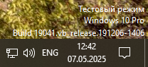
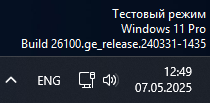

# Тестовые задания

Набор из двух тестовых [заданий](doc/tasks.pdf) (орфография и пунктуация автора сохранены) для разработчика ПО по защите и контролю доступа к чувствительным данным.

**Проект находится в разработке.**

# Сборка

Проект для первого задания написан в Vsual Studio 2022, настроена только конфигурация Debug для платформы x64.

Собранный со всеми последними правками и подписанный моим самоподписным сертификатом драйвер выложен в директории [driver](FileBlockerDriver/driver) (подписан и SYS- и CAT-файл).

### Тестовое задание #1

Для решения поставленной задчи был ***разработан драйвер мини-фильтра файловой системы***, который **блокирует опреции перемещения (в том числе в корзину), копирования и переименования файлов с заданным расширением (включая точку) и текстом (целиком, не более 256 символов) в начале**. Мини-фильтр драйвер предназначен для любых файловых систем, поддерживаемых ОС, однако его *возможности принудительно ограничены дисковыми файловыми системами*, поэтому использовать его, например, для сетевых файловых систем или файловых систем оптических дисков не получится.

Сертификата подписи кода с расширенной проверкой (EVCS) у меня нет, поэтому **драйвер подписан мои самоподписанным/самозаверенным [сертификатом](FileBlockerDriver/driver/FileBlockerDriver.cer)**, который нужно установить для <ins>локального компьютера</ins> в <ins>доверенные корневые центры сертификации</ins> перед установкой драйвера, а во время установки драйвера его нужно добавить в доверенные издатели, тогда Windows не будет выдавать предупреждений, но **работать драйвер всё равно будет ТОЛЬКО В ТЕСТОВОМ РЕЖИМЕ**, который включается с помощью команды:

    bcdedit /set testsigning on
    
в командной строке или PowerShell, запущенных от имени администратора. Также ***рекомендую включить режим отладки***:

    bcdedit /debug on
    
чтобы утилита DebugView из набора Sysinternals работала без проблем. Установка самого драйвера выполняется с помощью команды:

    pnputil /add-driver "<полный_путь_к_директории_с_драйвером>\FileBlockerDriver.inf" /install
    
а запуск фильтра:

    fltmc load FileBlockerDriver
    
Вывести список всех работающих фильтров можно с помощью команды:

    fltmc filters

Для остановки фильтра нужно выполнить команду:

    fltmc unload FileBlockerDriver
    
а для удаления драйвера: 
    
    pnputil /delete-driver "<полный_путь_к_директории_с_драйвером>\FileBlockerDriver.inf" /uninstall

Конфигурационный файл `FileBlockerDriver.ini` (не больше 1 КБ данных) копируется в директорию с драйвером при его установке, а имя конфигурационного файла прописывается в реестр. Также в коде есть значения по умолчанию как для пути к конфигурационному файлу (`C:\config.ini`, для использования нужно собрать драйвер с макросом `USE_DEFAULT_CONFIG_PATH`), так и для параметров мини-фильтра (такие же как в конфигурационном файле из репозитория, используются при отсутствии соответствующих параметров или их значений в локальном конфигурационном файле).

Ещё **рекомендую использовать макрос `USE_FULL_CONFIG_PATH`**, который задействует функционал по получению полного пути к конфигурационному файлу, но это необязательно, так как функция `ZwOpenFile()` сможет открыть его используя только предоставленные ей имя (полученное из реестра) и `RootDirectory` (полученный с помощью функции `IoGetDriverDirectory()`), который, кстати, можно закрыть сразу после открытия конфигурационного файла. Оговоренный макрос можно использовать только если не используется макрос `USE_DEFAULT_CONFIG_PATH`, использовать который я **настоятельно не рекомендую**.

***Протестированы все четыре варианта сборки (речь про макросы), но, разумеется, только конфигурация Debug.***

Пример отладочного вывода:

Тестировал в Windows 10 build 19041

а также в Windows 11 build 26100

***Минимальная поддерживаемая версия ОС - Windows 10 build 19041***. В версиях младше работать не будет из-за используемой в коде функции [`ExAllocatePool2`](https://www.learn.microsoft.com/en-us/windows-hardware/drivers/ddi/wdm/nf-wdm-exallocatepool2). В коде есть проверка версии ОС.
