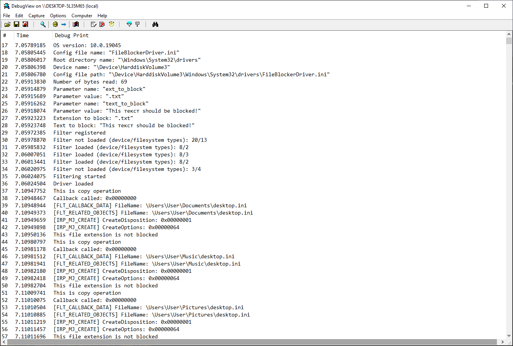
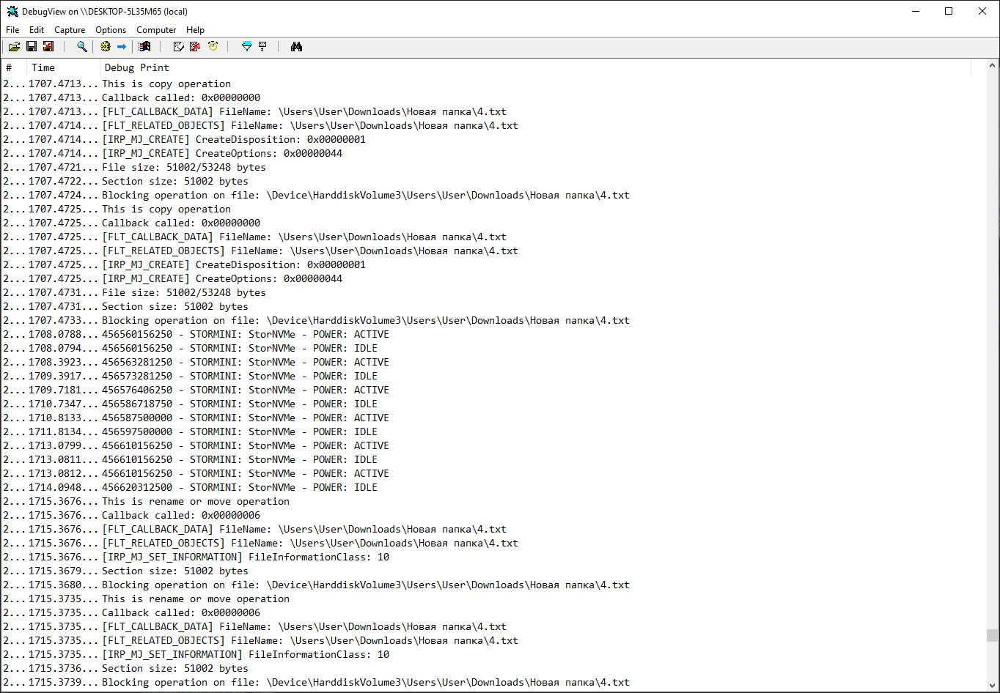

# Тестовые задания

Набор из двух тестовых [заданий](doc/tasks.pdf) (орфография и пунктуация автора сохранены) для разработчика ПО по защите и контролю доступа к чувствительным данным.

**Проект находится в разработке.**

# Сборка

Проект для первого задания написан в Vsual Studio 2022, настроена только конфигурация Debug для платформы x64.

Собранный со всеми последними правками и подписанный моим самоподписным сертификатом драйвер выложен в папке `driver`.

### Тестовое задание #1

Для решения поставленной задчи был ***разработан драйвер мини-фильтра файловой системы***, который **блокирует опреции перемещения (в том числе в корзину), копирования и переименования файлов с заданным расширением (включая точку) и текстом (целиком, не более 256 символов) в начале**. Мини-фильтр драйвер предназначен для любых файловых систем, поддерживаемых ОС, однако его *возможности принудительно ограничены дисковыми файловыми системами*, поэтому использовать его, например, для сетевых файловых систем или файловых систем оптических дисков не получится.

Сертификата подписи кода с расширенной проверкой (EVCS) у меня нет, поэтому **драйвер подписан** мои **[самоподписным сертификатом](FileBlockerDriver/driver/DriverCert.cer)** (его нужно установить для локального компьюетра в доверенные корневые центры сертификации, а при первой установке драйвера он также может быть добавлен в доверенные издатели, тогда Windows не будет выдавать никаких предупреждений) и **будет работать только в тестовом режиме**, который включается с помощью команды:

    bcdedit /set testsigning on
    
в командной строке или PowerShell, запущенных от имени администратора. Также **рекомендую включить режим отладки**:

    bcdedit /debug on
    
чтобы утилита DebugView из набора Sysinternals работала без проблем. Установка самого драйвера выполняется с помощью команды:

    pnputil /add-driver "<полный_путь_к_директории_с_драйвером>\FileBlockerDriver.inf" /install
    
а запуск фильтра:

    fltmc load FileBlockerDriver
    
Вывести список всех работающих фильтров можно с помощью команды:

    fltmc filters

Для остановки фильтра нужно выполнить команду:

    fltmc unload FileBlockerDriver
    
а для удаления драйвера: 
    
    pnputil /delete-driver "<полный_путь_к_директории_с_драйвером>\FileBlockerDriver.inf" /uninstall

Конфигурационный файл `FileBlockerDriver.ini` (не больше 1 КБ данных) копируется в директорию `\SystemRoot\System32` при установке драйвера, а путь к нему прописывается в реестр. Также в коде есть значения по умолчанию как для пути к конфигурационному файлу (`C:\config.ini`), так и для параметров мини-фильтра (такие же как в конфигурационном файле).

Пример отладочного вывода:

